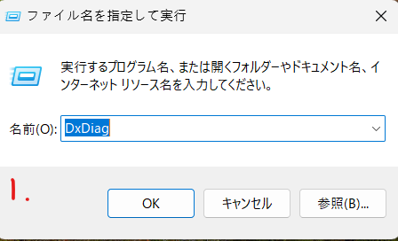
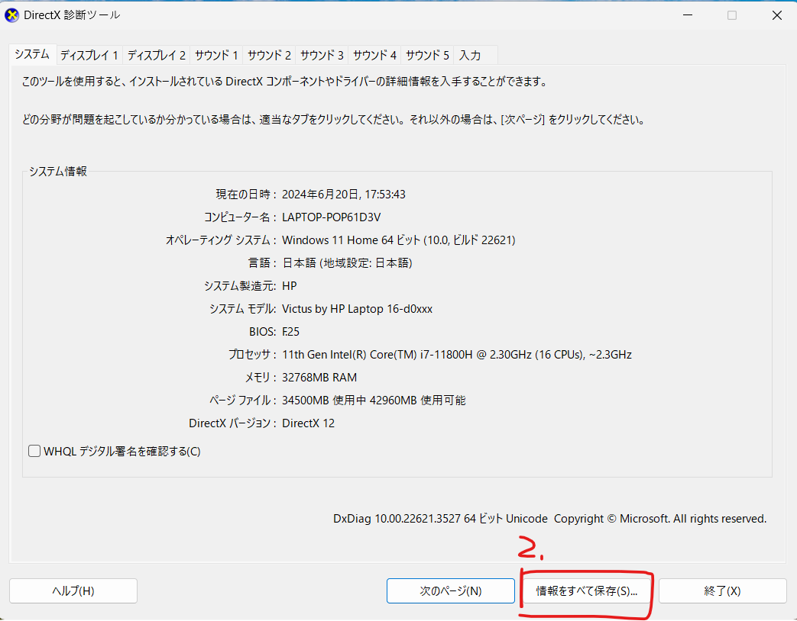
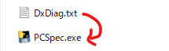

Run Build/PCSpec.exe

Will auto run Dxdiag and convert Dxdiag.txt to a simple spec info
----------------------------------------------------------------------

電腦資料出輸工具使用說明

■■　取得當前PC系統資訊與簡易資訊
PCSpec.exeを実行する

■■　手動轉譯指定Dxdiag資料方式
Ctrl+R > DxDiag

打開系統介面後，按右下角的輸出按鈕，將系統資料存成Txt

把系統資料Txt拖拉至PCSpec.exe 來產生基礎電腦資料

Step

1) 
2) 
3) 

----------------------------------------------------------------------
電腦資料の出力ツールの使用方法についてです

■■　自動にデータを作成する場合
PCSpec.exeを実行する

■■　手動でDxdiagデータを簡易データにコンバートする場合
Ctrl+R > DxDiag

システムインターフェースを開きます。
「Ctrl+R」を押して、ダイアログボックスに「DxDiag」と入力してEnterキーを押します。
系統介面を開いた後、按右下角的輸出按鈕，將系統資料存成Txt

開いたシステムインターフェースで、右下の「輸出」ボタンをクリックします。
系統資料をテキストファイル（Txt）として保存します。
把系統資料Txt拖拉至PCSpec.exe

PCSpec.exeアプリケーションに、保存した系統資料のTxtファイルをドラッグアンドドロップします。
電腦の基本情報が出力されます。
この手順に従うことで、システムの情報を簡単に取得し、必要に応じてPCSpec.exeを使用して基本的な電腦情報を確認できます。

Step

1) 
2) 
3) 